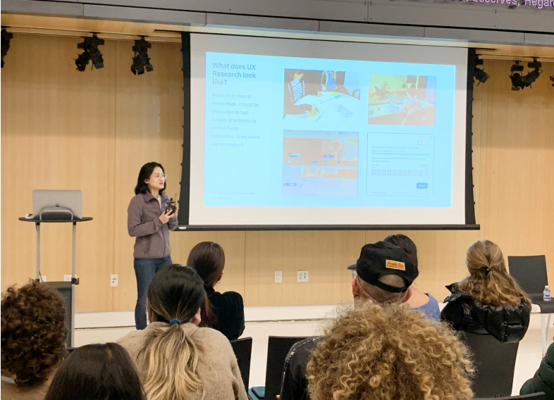
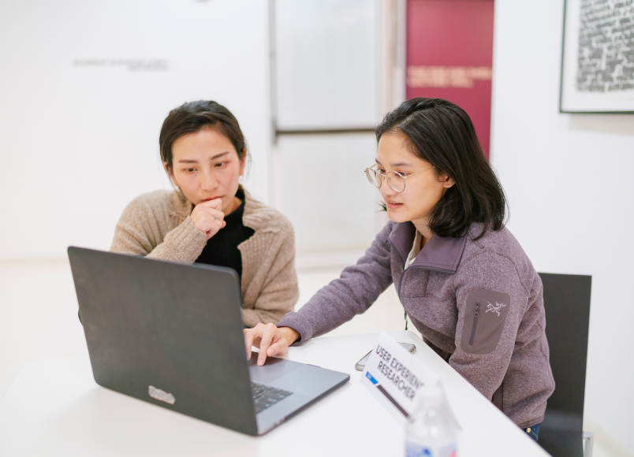
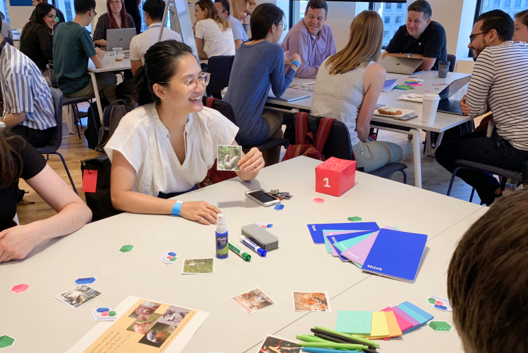
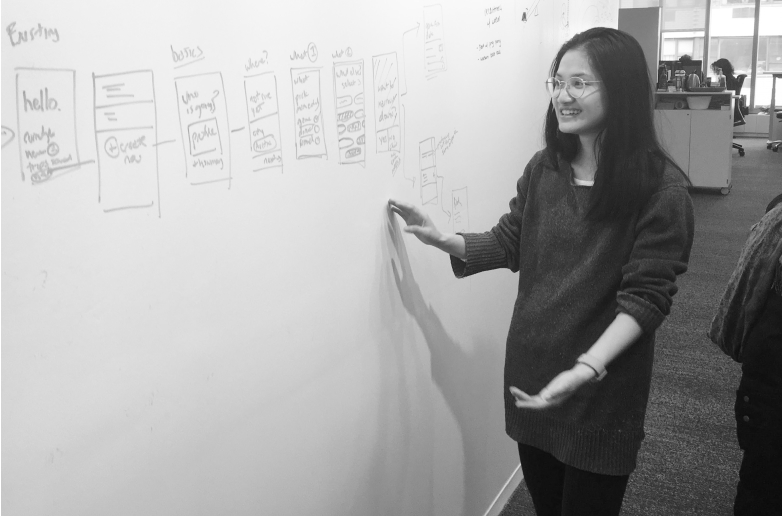

# About me { #index-title }

### As a designer I believe in making intuitive and accesible designs. I’m a storyteller first weaving in the needs of the user and business. **My specialty is bringing different teams to work together.**

I grew up in Vancouver, Montreal, and Toronto and I am currently based in NYC. My path into design began like many others - on Neopets! This was where I started to learn to design and code by creating shop fronts for other players.

  
  

Drawing from my background in cognitive and computer sciences, I bring a research-driven perspective into my projects and can easily communicate and collaborate with developers and stakeholders across teams. I am always curious about why people make the decisions they do, and I find it exciting to design functional, accessible solutions that is **scaled for a large number of people, externally and also internally.**

When I am not designing you may find me taking street photos, making crooked pots, or finding the next plant to add to my home.

I also watch a lot of movies and tv and have a collection of [UI stills](https://www.are.na/anna-nguyen-0rkqu6uzk-q/user-interfaces-in-film-and-tv) I find inspiring.

  
  

